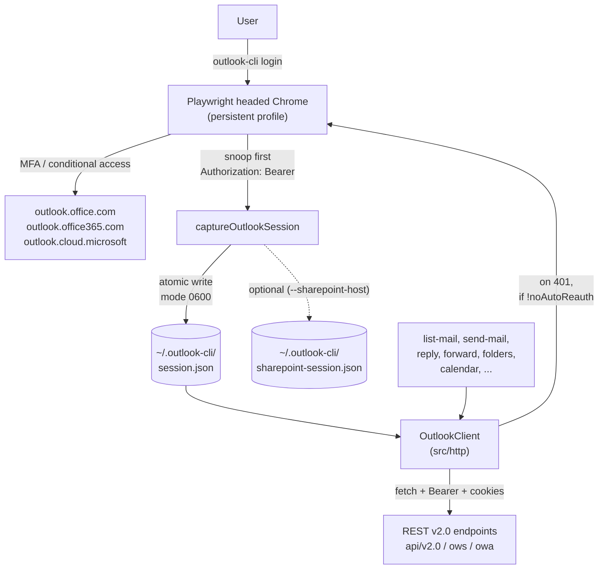

# outlook-cli

> Drive your Microsoft 365 Outlook mailbox from the command line by replaying the same Bearer token that Outlook Web already carries. No app registration, no admin consent, no Graph OAuth client.

[](https://github.com/weirdapps/outlook-access/actions/workflows/ci.yml)
[](https://github.com/weirdapps/outlook-access/actions/workflows/codeql.yml)
[](https://github.com/weirdapps/outlook-access/actions/workflows/sonarcloud.yml)
[](LICENSE)
[](https://nodejs.org/)

`outlook-cli` opens a real Chrome window (via Playwright) exactly once, watches the outbound requests Outlook Web already makes, and grabs the `Authorization: Bearer` header plus session cookies. The capture is written atomically to `~/.outlook-cli/session.json` (file mode `0600`, parent directory mode `0700`) and replayed against the REST v2.0 surface at `outlook.office.com`, `outlook.office365.com`, or `outlook.cloud.microsoft`. Every subsequent command is scriptable and non-interactive. When the token expires the tool silently re-opens Chrome (headless, using the persisted profile) unless you pass `--no-auto-reauth`.

Who it is for:

- Individual users on any modern Microsoft 365 tenant (work, school, or personal) who want to script their own mailbox without touching Azure app registrations.
- Automations that need mail, calendar, folders, threads, replies, forwards, and SharePoint reference-attachment downloads from a single POSIX-friendly binary.
- Tenants where IMAP / SMTP is disabled by policy and where EWS is gone or unreliable.

Not a fit: consumer `outlook.live.com` / `hotmail.com` mailboxes (different API surface), or automations that need to bypass conditional access or MFA (those go through the browser exactly as a human would).

This repo is the source of the `outlook-cli` binary. It is also consumed as a git-pinned npm dependency by the `outlook-bridge` MCP server in the [plessas-marketplace `mail` plugin](https://github.com/weirdapps/plessas-marketplace/tree/master/plugins/mail), which surfaces the same command surface to Claude Code. Sister project: [`teams-access`](https://github.com/weirdapps/teams-access) applies the identical web-session capture pattern to Microsoft Teams.

## Why this exists

Scripting a personal M365 mailbox is heavy for a single user:

- **Microsoft Graph** wants an app registration, admin consent, an OAuth client, `Mail.*` / `Calendars.*` scopes, and a redirect-URI story.
- **EWS / MAPI** is deprecated, Windows-flavoured, and often out of tenant.
- **IMAP / SMTP** is usually disabled by policy in modern M365 tenants.

If you can sign in to `outlook.office.com` in a browser, you can already reach the mailbox. `outlook-cli` uses that fact: sign in once, capture the token, replay it. Nothing bypasses conditional access, MFA, or tenant policy.

## Commands

Nineteen subcommands are wired up in `src/cli.ts`. Every command emits JSON on stdout by default and accepts `--table` for a compact human view. Errors are always emitted as JSON on stderr with a `code` field and a numeric exit code (see [Exit codes](#exit-codes)).

| Command                          | Purpose                                                                                                                                                                                                                                                                                                                            |
| -------------------------------- | ---------------------------------------------------------------------------------------------------------------------------------------------------------------------------------------------------------------------------------------------------------------------------------------------------------------------------------- |
| `login`                          | One-shot headed Chrome window. Captures the first outbound Bearer plus cookies and writes `session.json`. `--sharepoint-host <host>` also captures a SharePoint session. `--force` ignores any cached session.                                                                                                                     |
| `auth-check`                     | Non-interactive verification that the cached session is still accepted.                                                                                                                                                                                                                                                            |
| `auth-renew`                     | Silent (headless) bearer refresh using the persisted browser profile. `--sharepoint-host` also refreshes a SharePoint session.                                                                                                                                                                                                     |
| `list-mail`                      | List messages from a folder. Supports `--folder` / `--folder-id` / `--folder-parent`, `--since` / `--until` or keyword-aware `--from` / `--to`, `--all` pagination with `--max` safety cap, `--select`, and `--just-count` (server-side `$count=true`).                                                                            |
| `get-mail <id>`                  | Retrieve one message. `--body` accepts `html`, `text`, or `none`.                                                                                                                                                                                                                                                                  |
| `get-thread <id>`                | Retrieve every message in a conversation, across folders. Accepts `conv:<conversationId>` to skip the resolve hop. `--order` accepts `asc` or `desc`; `--body` as above.                                                                                                                                                           |
| `download-attachments <id>`      | Save non-inline attachments to `--out <dir>`. `--include-inline`, `--overwrite`.                                                                                                                                                                                                                                                   |
| `download-sharepoint-link <url>` | Fetch a `ReferenceAttachment.SourceUrl` (SharePoint / OneDrive for Business) using the captured SharePoint session.                                                                                                                                                                                                                |
| `list-calendar`                  | List events in a window. `--from` / `--to` accept ISO-8601 or keywords (`now`, `now + 7d`).                                                                                                                                                                                                                                        |
| `get-event <id>`                 | Retrieve one calendar event. `--body` as above.                                                                                                                                                                                                                                                                                    |
| `list-folders`                   | List folders under a parent (well-known alias, path, or `id:<raw>`). `--recursive`, `--include-hidden`, `--first-match`.                                                                                                                                                                                                           |
| `find-folder <spec>`             | Resolve a folder query to a single `ResolvedFolder`. `--anchor`, `--first-match`.                                                                                                                                                                                                                                                  |
| `create-folder <path>`           | Create (or idempotently reuse) a mail folder. `--parent`, `--create-parents`, `--idempotent`.                                                                                                                                                                                                                                      |
| `move-mail <ids...>`             | Move one or more messages to `--to <spec>`. `--continue-on-error` collects failures instead of aborting. Per-message failures still set exit 5.                                                                                                                                                                                    |
| `send-mail`                      | Compose and send. Default: creates a draft and activates Outlook desktop (macOS only). `--send-now` dispatches immediately. `--to` / `--cc` / `--bcc`, `--subject`, `--html` / `--text`, `--attach` (repeatable, combined cap 30 MB), `--signature`, `--no-signature`, `--no-cc-self`, `--no-save-sent`, `--no-open`, `--dry-run`. |
| `capture-signature`              | Extract a signature from a SentItems message and save to `~/.outlook-cli/signature.html`. `--from-message <id>`, `--out <file>`.                                                                                                                                                                                                   |
| `reply <id>`                     | Reply to a message. Auto-quotes original, appends signature. Same draft-first / `--send-now` model as `send-mail`.                                                                                                                                                                                                                 |
| `reply-all <id>`                 | Reply-all. Recipients are pre-populated by M365.                                                                                                                                                                                                                                                                                   |
| `forward <id>`                   | Forward a message. `--to` required. Auto-quotes original.                                                                                                                                                                                                                                                                          |

Run `outlook-cli <command> --help` for the full flag set on each subcommand.

## How it works



The SharePoint capture path additionally handles cookie-authenticated tenants (no Bearer) and captures through the Microsoft Cloud App Security (MCAS) proxy plus Service Worker in headless mode. See `src/auth/sharepoint-capture.ts` for the details.

## Requirements

- **Node.js 20 LTS or newer.** CI runs Node 22. Older Node lacks global `fetch` and other APIs the tool depends on.
- **npm 10 or newer** (bundled with modern Node). `package-lock.json` is committed. Yarn / pnpm are not supported.
- **Google Chrome or Microsoft Edge installed locally.** Playwright launches your installed browser via the channel mechanism (`chromium.launchPersistentContext({ channel })`) and does not download its own Chromium build. Accepted channels: `chrome` (default), `chrome-beta`, `chrome-dev`, `msedge`, `msedge-beta`.
- **A Microsoft 365 / Office 365 mailbox** you can sign in to at `outlook.office.com`. Consumer `outlook.live.com` / `hotmail.com` mailboxes use a different API surface and are not supported.
- Outbound HTTPS to `outlook.office.com`, `login.microsoftonline.com`, and any conditional-access endpoints your tenant routes through.
- Write access to `$HOME`. The session file lives at `$HOME/.outlook-cli/session.json`. POSIX file-mode enforcement is strict on macOS and Linux. On Windows the file is still written atomically, but ACL hardening is your responsibility.

## Install and build

```bash
git clone https://github.com/weirdapps/outlook-access.git
cd outlook-access
npm install
npm run build          # emits dist/cli.js (chmod +x in postbuild)
```

Link the CLI globally so you can invoke it as `outlook-cli` from anywhere:

```bash
npm link               # installs a symlink at $(npm prefix -g)/bin/outlook-cli
```

Or run the TypeScript sources directly without building:

```bash
npx ts-node src/cli.ts <subcommand> [options]
# or
npm run cli -- <subcommand> [options]
```

## First use

```bash
outlook-cli login
```

Chrome opens at `https://outlook.office.com/`. Sign in normally, completing whatever MFA or conditional-access step your tenant requires. The tool watches outbound requests, captures the first `Authorization: Bearer` header it sees, closes the window, and writes `~/.outlook-cli/session.json`.

Verify:

```bash
outlook-cli auth-check
# {
#   "status": "ok",
#   "tokenExpiresAt": "2026-04-22T15:03:25.000Z",
#   "account": { "upn": "you@yourtenant.com" }
# }
```

After that, every subcommand replays the cached session. When the token expires, the default behaviour is to re-open the browser silently and refresh it. Pass `--no-auto-reauth` if you want expired-session failures to be hard errors (exit 4) instead.

To also capture a SharePoint session for `download-sharepoint-link`:

```bash
outlook-cli login --sharepoint-host <tenant>.sharepoint.com
# writes ~/.outlook-cli/sharepoint-session.json
```

## Usage

### Mail

```bash
# Most recent 5 inbox messages, as a table
outlook-cli list-mail --top 5 --table

# A specific message, body as text
outlook-cli get-mail AAMkAGI... --body text > message.json

# Save all non-inline attachments to ./att
outlook-cli download-attachments AAMkAGI... --out ./att

# Incremental sync: last 24h, paginated, capped at 5000
outlook-cli list-mail \
  --folder Inbox \
  --since "$(date -u -v-24H +%Y-%m-%dT%H:%M:%SZ)" \
  --all --max 5000 --json

# Explicit date window
outlook-cli list-mail \
  --since 2026-04-01T00:00:00Z \
  --until 2026-04-08T00:00:00Z \
  --all --json

# Server-side count only (no message rows)
outlook-cli list-mail --folder Inbox --just-count

# Full thread across folders (or pass "conv:<id>" to skip the resolve hop)
outlook-cli get-thread AAMkAGI... --order asc
```

`--since` / `--until` add a server-side `$filter` on `ReceivedDateTime`. The newer `--from` / `--to` accept the same ISO-8601 plus keywords (`now`, `now+7d`, `now-24h`). `--all` walks `@odata.nextLink` until exhausted. `--max <N>` is the safety cap (default 10000, max 100000). When the cap is hit and more results remain, a `max_results_reached` warning is emitted on stderr and the partial result is returned.

### Send, reply, forward

```bash
# Compose new email; default creates a draft and activates Outlook desktop (macOS)
outlook-cli send-mail \
  --to "alice@example.com" "bob@example.com" \
  --cc "carol@example.com" \
  --subject "Q2 review" \
  --html body.html

# Skip the draft, send immediately
outlook-cli send-mail \
  --to "alice@example.com" \
  --subject "quick update" \
  --html body.html \
  --send-now

# Attach files (combined cap 30 MB)
outlook-cli send-mail \
  --to "alice@example.com" \
  --subject "report attached" \
  --html body.html \
  --attach report.pdf --attach slides.pptx

# Reply to a message (auto-quotes original, appends signature)
outlook-cli reply AAMkAGI... --html reply.html

# Reply-all
outlook-cli reply-all AAMkAGI... --html reply.html --send-now

# Forward (--to required)
outlook-cli forward AAMkAGI... \
  --to "dave@example.com" \
  --html note.html

# Extract your signature from the latest SentItems message
outlook-cli capture-signature
outlook-cli capture-signature --from-message AAMkAGI...
```

All send / reply / forward commands default to draft-first: the message is created as a draft and Outlook desktop is activated so you can review before sending. Pass `--send-now` to dispatch immediately. Automatic CC-self is on by default (suppress with `--no-cc-self`). Signature from `~/.outlook-cli/signature.html` is appended automatically (suppress with `--no-signature`). Outlook desktop activation is macOS-only. On Linux or Windows the draft is still created, `--no-open` becomes a no-op, and a `skipping (platform=..., only darwin is supported)` note is written to stderr.

### Calendar

```bash
# Next 14 days
outlook-cli list-calendar --from now --to "now + 14d" --table

# One event
outlook-cli get-event AAMkAGI...
```

### Folders

```bash
# Top-level folders
outlook-cli list-folders --table

# Full sub-tree (bounded)
outlook-cli list-folders --recursive --table

# Resolve a folder by path
outlook-cli find-folder "Inbox/Projects/Alpha"

# Create nested folder idempotently
outlook-cli create-folder "Inbox/Projects/Alpha" --create-parents --idempotent

# Move messages (by alias, path, or "id:<raw>")
outlook-cli move-mail AAMk... AAMk... --to "Inbox/Archive-2026"
outlook-cli move-mail AAMk... --to Archive
outlook-cli move-mail AAMk... --to "id:AAMkAGI..." --continue-on-error
```

### SharePoint reference attachments

Some Outlook messages carry `ReferenceAttachment` entries: SharePoint or OneDrive for Business shared links rather than inline binaries. Their content lives on `<tenant>.sharepoint.com`, which uses a different Bearer (or a cookie-only session, in MCAS-proxied tenants) from `outlook.office.com`. Capture that second session at login time:

```bash
outlook-cli login --sharepoint-host <tenant>.sharepoint.com
# writes ~/.outlook-cli/sharepoint-session.json (mode 0600)

outlook-cli download-sharepoint-link \
  "https://<tenant>.sharepoint.com/sites/foo/Documents/report.pdf" \
  --out ./att
```

If the SharePoint session file is missing or expired, the command exits with code 4 and prints the exact `outlook-cli login` invocation to recover.

### List mail from an arbitrary folder

```bash
outlook-cli list-mail --folder "Inbox/Projects/Alpha" --top 10 --table
outlook-cli list-mail --folder-id AAMkAGI... --top 20
outlook-cli list-mail --folder-parent Inbox --folder "Projects/Alpha"
```

## Output modes

Every subcommand supports two mutually exclusive formats:

- `--json` (default). Stable, on stdout, pipes cleanly into `jq` or scripts.
- `--table`. Human-readable, compact columns. IDs are never truncated so they can be copy-pasted back into other subcommands.

Errors are always emitted as JSON on stderr with `code`, optional `message`, and setting-specific fields (for example `missingSetting`, `path`, `failed[]`).

## Configuration

`outlook-cli` needs no configuration file for a basic install. Runtime plumbing has three tunable settings, each with a default:

| Setting                        | CLI flag                  | Env var                        | Default          |
| ------------------------------ | ------------------------- | ------------------------------ | ---------------- |
| Per-REST-call HTTP timeout     | `--timeout <ms>`          | `OUTLOOK_CLI_HTTP_TIMEOUT_MS`  | `30000` (30 s)   |
| Max wait for interactive login | `--login-timeout <ms>`    | `OUTLOOK_CLI_LOGIN_TIMEOUT_MS` | `300000` (5 min) |
| Playwright Chrome channel      | `--chrome-channel <name>` | `OUTLOOK_CLI_CHROME_CHANNEL`   | `chrome`         |

Additional overrides:

| Setting                | CLI flag                       | Env var                    | Default                             |
| ---------------------- | ------------------------------ | -------------------------- | ----------------------------------- |
| Session file path      | `--session-file <path>`        | `OUTLOOK_CLI_SESSION_FILE` | `~/.outlook-cli/session.json`       |
| Playwright profile dir | `--profile-dir <path>`         | `OUTLOOK_CLI_PROFILE_DIR`  | `~/.outlook-cli/playwright-profile` |
| IANA timezone          | `--tz <iana>`                  | `OUTLOOK_CLI_TZ`           | `process.env.TZ` or system tz       |
| Calendar window start  | `--from` (ISO-8601 or keyword) | `OUTLOOK_CLI_CAL_FROM`     | `now`                               |
| Calendar window end    | `--to` (ISO-8601 or keyword)   | `OUTLOOK_CLI_CAL_TO`       | `now + 7d`                          |

Precedence: CLI flag beats env var beats default. A malformed flag or env value still throws `ConfigurationError` (exit 3). The default only covers the unset case.

For persistent overrides, source a shell file (for example `outlook-cli.env`) from your `~/.zshrc` or `~/.bashrc`.

### SharePoint host examples

- NBG tenant: `groupnbg.sharepoint.com`
- Other tenants: `<tenant>.sharepoint.com` (whatever host serves the shared link)

### Runtime data under `~/.outlook-cli/`

| Path                                  | Written by                                                | Purpose                                                                                             |
| ------------------------------------- | --------------------------------------------------------- | --------------------------------------------------------------------------------------------------- |
| `session.json` (mode 0600)            | `login`, `auth-renew`, silent re-auth                     | Bearer token, cookies, account UPN. Read by every REST call.                                        |
| `sharepoint-session.json` (mode 0600) | `login --sharepoint-host`, `auth-renew --sharepoint-host` | SharePoint Bearer or cookies for `download-sharepoint-link`.                                        |
| `playwright-profile/` (mode 0700)     | Playwright persistent context                             | Persists browser state so silent re-auth works headless.                                            |
| `signature.html`                      | `capture-signature`                                       | Optional. Auto-appended by `send-mail` / `reply` / `reply-all` / `forward` unless `--no-signature`. |
| `signature-assets/`                   | `capture-signature` (as needed)                           | Inline images extracted from the signature.                                                         |

Nothing in `~/.outlook-cli/` is ever printed or logged. Body-snippet redaction (`src/util/redact.ts`) runs on every error path.

### Exit codes

| Code | Meaning                                                                                                   |
| ---- | --------------------------------------------------------------------------------------------------------- |
| `0`  | Success                                                                                                   |
| `1`  | Unexpected error                                                                                          |
| `2`  | Invalid usage (bad argv, commander error)                                                                 |
| `3`  | Configuration error (malformed flag or env var)                                                           |
| `4`  | Auth failure (expired or rejected session, user cancelled login, `--no-auto-reauth` with no cache)        |
| `5`  | Upstream API error (non-401 HTTP error, timeout, network failure, pagination limit, partial move failure) |
| `6`  | IO error (folder collision without `--idempotent`, file collision without `--overwrite`)                  |

## Architecture

```text
src/
  cli.ts                    Commander wiring, global options, error mapping
  auth/
    browser-capture.ts      Playwright login + first-Bearer capture
    sharepoint-capture.ts   SharePoint session capture (Bearer or cookie, MCAS-proxy aware)
    jwt.ts                  Base64-URL decode + expiry parsing
    lock.ts                 Session-file locking
  session/
    schema.ts               SessionFile type + validation
    sharepoint-schema.ts    SharePoint session file type + IO
    store.ts                Atomic read / write with fs-atomic
  http/
    outlook-client.ts       fetch() wrapper: Bearer + cookies + 401 re-auth
    sharepoint-client.ts    SharePoint fetch() wrapper
    filter-builder.ts       Server-side $filter helpers
    errors.ts               UpstreamError, CollisionError, ...
    types.ts                MessageSummary, EventSummary, FolderSummary, ...
  folders/
    resolver.ts             Well-known alias / path / id:<raw> resolution
    types.ts                ResolvedFolder, CreateFolderResult, MoveMailResult
  commands/                 One file per subcommand (17 files; reply.ts handles reply, reply-all, forward)
  config/
    config.ts               loadConfig with flag > env > default precedence
    errors.ts               ConfigurationError, AuthError, IoError, ...
  output/
    formatter.ts            JSON and table rendering (ColumnSpec)
  util/                     Dates, filenames, atomic fs, macOS Outlook activation, redaction, signature assets
test_scripts/               vitest suites
docs/
  design/                   project-design.md, plan-NNN-*.md, refined-request-*.md, configuration-guide.md
  reference/                Codebase scans
  research/                 Outlook REST v2.0 quirks
  superpowers/              Repo-automation workflow notes
scripts/
  pii-gauntlet.sh           Grep gauntlet for accidental PII in fixtures / docs
```

### Runtime dependencies

Runtime footprint is deliberately small: one direct dependency for CLI parsing, one optional dependency for the login browser.

| Package                                           | Version              | Role                                                                                                                                      |
| ------------------------------------------------- | -------------------- | ----------------------------------------------------------------------------------------------------------------------------------------- |
| [`commander`](https://github.com/tj/commander.js) | `^14.0.3`            | CLI parser: subcommands, options, help output                                                                                             |
| [`playwright`](https://playwright.dev/)           | `^1.59.1` (optional) | Drives the headed Chrome window during `login` and captures the outbound Bearer. Lazy-loaded so read-only commands skip the browser init. |

Everything else (HTTP, JSON, file IO, crypto, timezone math, JWT decode) uses Node's built-in `node:*` modules.

## Development

```bash
npm install                # installs deps and playwright as an optional dep
npm run build              # tsc; emits dist/cli.js and chmod +x
npm run lint               # eslint .
npm test                   # vitest run (394 tests across 34 files at v1.5.0)
npm run test:watch         # incremental vitest
npm run test:coverage      # vitest run --coverage (v8)
npm run format             # prettier --write .
```

CI (`.github/workflows/ci.yml`) runs `npm ci --ignore-scripts`, then lint, build, and test on Node 22. CodeQL scans on push, pull request, and a weekly cron. SonarCloud runs on push and pull request. Dependabot manages npm and GitHub Actions updates with an auto-merge workflow for patch and minor bumps only. A monthly `deps-refresh` workflow (via `weirdapps/shared-workflows`) opens a consolidated PR when lock-only updates are available.

### PII gauntlet

`scripts/pii-gauntlet.sh` greps fixtures, docs, and source for accidentally committed personal data. Run it before opening a PR that touches test fixtures or documentation.

## Consumed by

- **`outlook-bridge` MCP server** in the [plessas-marketplace `mail` plugin](https://github.com/weirdapps/plessas-marketplace/tree/master/plugins/mail). It installs `outlook-tool` from this repo as a git-pinned dependency and exposes the same command surface to Claude Code as MCP tools (`outlook_list_mail`, `outlook_send_mail`, `outlook_reply`, ...).
- **Sister project**: [`teams-access`](https://github.com/weirdapps/teams-access) applies the identical web-session capture pattern to Microsoft Teams.

## Security posture

The session file contains a live Bearer token (or cookies) and is written atomically under a `0700` directory with mode `0600`. It is never printed or logged (body-snippet redaction runs on every error path) and is `.gitignore`d alongside the Playwright profile directory. Disclosure policy: see [`SECURITY.md`](SECURITY.md).

## Origin

Forked from [BikS2013/outlook-tool](https://github.com/BikS2013/outlook-tool) by Giorgos Marinos, whose core insight (capturing an Outlook Web bearer via headed Playwright and reusing it against `outlook.office.com/api/v2.0`) made this approach viable. The codebase has since been substantially rewritten and extended: folder management, send / reply / forward with signature and inline-image support, silent token renewal, SharePoint reference attachments (Bearer and cookie-only, MCAS-aware), atomic session storage with file locking, redaction on every error path, and the current 394-test vitest suite.

## License

MIT. See [LICENSE](LICENSE) for the full text and the dual copyright covering the original upstream and this fork's substantial rewrite.
